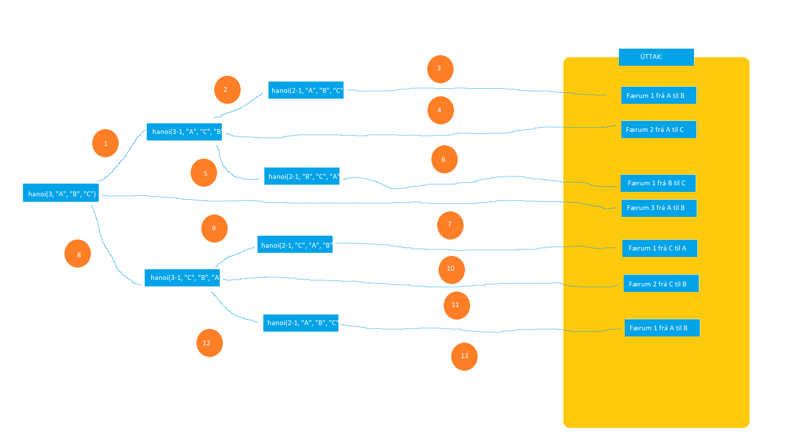

 # Reiknirit - Verkefni 3

2. Hann væri O(2n) því fallið keyrir tvisvar í hvert sinn sem það keyrir.

3. 
   1. O (Big O notation) segir til um hversu oft fall keyrir. Ef það er O(1) keyrir fallið bara einu sinni. Ef það er O(n) keyrir það jafn oft og inntakið, t.d. að plúsa saman allar tölur frá 0 upp í n.

   2. O(n^2) þýðir að fallið keyri jafn oft og n í öðru veldi (t.d. með for loopu inn í for loopu).  Það væri t.d. Fibonacci.

   3. O(log(n)) þýðir að fallið keyri log(n) sinnum, t.d. quicksort.

 4. 
    1. Ef n er bara 2 er það 26^n - 26, en ef þar er meira þá er það 26^n - (k - 26) þar sem k 26^n*25 þar sem n er fjöldi stafa sem eru eftir í strengum þegar eins stafir eru settir í.  Fyrir 3 er það (26*25 + 26*25 + 26*25) svo það væri þá 26^3-(26*25+26*25+26*25+26)=15600 þar sem það eru þrír möguleikar með einn staf eftir.  Með fjóra stafi væri það mikið lengra með bæði 26^2*25 og 26*25.
    2. Hann er O(26^n) (allvega hjá mér en það er örugglega til fljótlegri leið).  Með tveim tölum tekur það 0.001s, með þrem er það 0.02s, með fjórum 0.31s og með fimm 7.23s.

5. 
    1. Já það skipti máli því það fer með for loopu gegnum strenginn svo það tekur lengri tínma ef hann er lengri.
    2. Hún kláraði aldrei af einhverji ástæði, líka með -Ounchecked sem ætti að compila í næstum eins kóða og C.  En það ætti að vera O(m*n*r) þar sem r er hversu oft það þarf að fara gegnum listann.
    3. Já hún myndi gera það því það er mun fljótlegra að bera saman heiltölur
